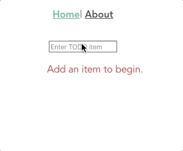

# TODO app

This is a project for me to learn how to understand Vue a little better.

It is a very simple input and conditional render, in the style of a "todo" list.



## Project setup

```
npm install
```

### Compiles and hot-reloads for development

```
npm run serve
```

### Compiles and minifies for production

```
npm run build
```

### Run your unit tests

```
npm run test:unit
```

### Run your end-to-end tests

```
npm run test:e2e
```

### Lints and fixes files

```
npm run lint
```

### Customize configuration

See [Configuration Reference](https://cli.vuejs.org/config/).
